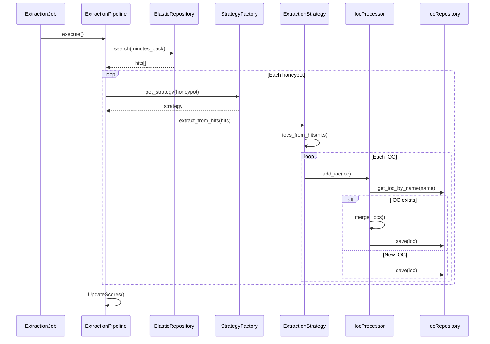

# Extraction Process

This file offers an overview of how GreedyBear extracts and processes T-Pot data. The ExtractionJob shown in the diagram runs every 10 minutes by default.

A single `ExtractionPipeline` instance (now in `greedybear/extraction/extraction_pipeline.py`) orchestrates the extraction of all available honeypots. It uses the `ElasticRepository` to receive a list of all honeypot hits from a certain time window. For each honeypot it gets the corresponding `ExtractionStrategy` (found in `greedybear/extraction/strategies/`), which contains all the extraction logic that is specific for a certain type of honeypot (e.g. Cowrie). The `ExtractionStrategy` uses this logic to create IOC objects and hands them to the `IocProcessor` (located in `greedybear/extraction/ioc_processor.py`), which is responsible for processing them so they can be written to the database via the `IocRepository`.
