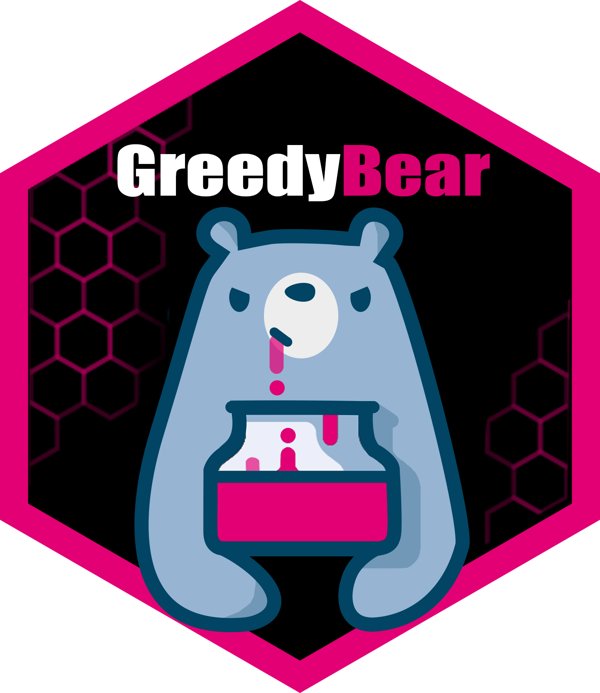
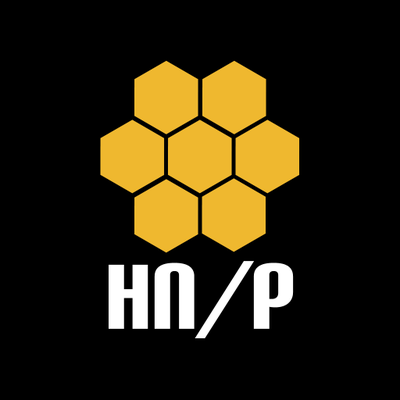

# GreedyBear

The project goal is to extract attack data detected by a [T-Pot](https://github.com/telekom-security/tpotce) or a cluster of them and to generate some feeds that can be used to prevent and detect attacks. You can read the [official announcement here](https://www.honeynet.org/2021/12/27/new-project-available-greedybear/).

## How to ...
- **... try it out**: visit the [public instance](https://greedybear.honeynet.org) provided by [The Honeynet Project](https://www.honeynet.org) and take a look at a [threat intelligence live feed example](https://greedybear.honeynet.org/api/feeds/cowrie/all/recent.txt)
- **... dive in**: read through our documentation in the [Wiki](https://github.com/GreedyBear-Project/GreedyBear/wiki) and explore GreedyBear's features
- **... run your own instance**: to leverage everything GreedyBear has to offer, you might want to [install](https://github.com/GreedyBear-Project/GreedyBear/wiki/Installation) it and connect it to your own T-Pot
- **... stay up to date**: [read](https://greedybear-project.github.io/) and [subscribe](https://greedybear-project.github.io/feed.xml) to our blog, where we regularly write about the most recent changes and new features
- **... contact us**: using a Github [issue](https://github.com/GreedyBear-Project/GreedyBear/issues) or start a [discussion](https://github.com/GreedyBear-Project/GreedyBear/discussions)
- **... contribute**: read through our [contribution guidelines](https://github.com/GreedyBear-Project/GreedyBear/wiki/Contribute), open an [issue](https://github.com/GreedyBear-Project/GreedyBear/issues), get assigned and raise a [pull request](https://github.com/GreedyBear-Project/GreedyBear/pulls)

## Sponsors and Acknowledgements

#### The Honeynet Project

[The Honeynet Project](https://www.honeynet.org) is a non-profit organization working on creating open source cyber security tools and sharing knowledge about cyber threats.

Thanks to [The Honeynet Project](https://www.honeynet.org) we are providing free public feeds available [here](https://greedybear.honeynet.org).

#### Google Summer of Code

In 2026 we started participating in the [Google Summer of Code](https://summerofcode.withgoogle.com/) (GSoC)!

If you are interested in participating in the next Google Summer of Code, check all the info available in the [dedicated repository](https://github.com/intelowlproject/gsoc)!

## Maintainers and Contributors

This project was started as a personal Christmas project by [Matteo Lodi](https://twitter.com/matte_lodi) in 2021.

Special thanks to:
- [Tim Leonhard](https://github.com/regulartim) for having greatly improved the project and added Machine Learning Models during his master thesis. He's the current Principal Maintainer.
- [Martina Carella](https://github.com/carellamartina) for having created the GUI during her master thesis.
- [Daniele Rosetti](https://github.com/drosetti) for helping maintaining the Frontend.
- and everyone who has contributed to GreedyBear!

## License
Distributed under the MIT license. See [`LICENSE`](LICENSE) for the full text.
